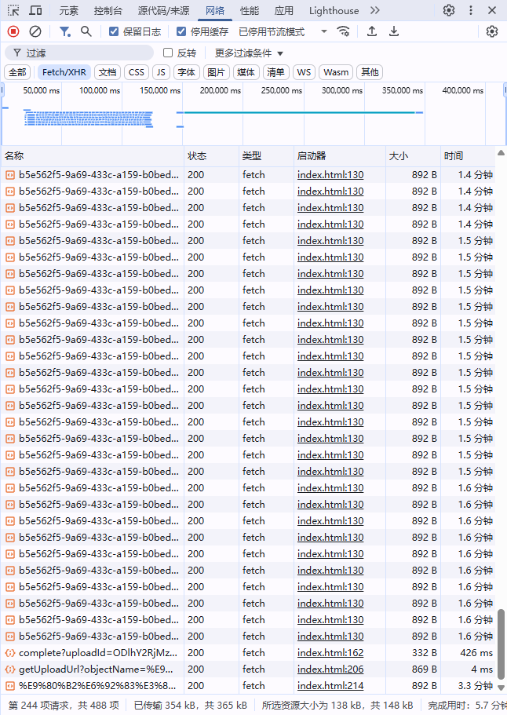

# 大文件分片上传demo

[参考文章1](https://juejin.cn/post/7213275960900632632)
[参考文章2](https://juejin.cn/post/7039554714077233189)

## 测试结果

### 测试环境

- html page : vscode live server
- api : local idea(win11) debug mode
- minio server : AliYun CentOS 7.9 / 2核(vCPU) 2 GiB / 3Mbps

### 测试结果

图一、图二为两次上传的测试截图，图三为测试的浏览器网络截图，~~以增强测试的真实性~~

由此大概得到
1. 对于一个142MB大小的视频，分片方式速度的提升为44.58%左右 具体数值为11.208s
2. 对于一个1202MB大小的视频，分片方式速度的提升为46.79%左右 具体数值为92.381s

## 项目结构

1. front-end - html测试目录 直接打开 更改对应的接口地址即可测试
2. src - 后端源代码目录
   - 这里有一个地方需要注意 minio的配置项需要一个application-dev.yaml
   - 或者直接将自己的配置明文写在application.yaml中
   - 再或者可以写在环境变量中 （edit configuration中可以配置）
3. 其他是常规的springboot项目文件 不做说明

## 处理思路

1. 前端计算文件哈希 获取唯一标识 然后将文件切片 将切片数和文件哈希以及文件名封装 发送上传请求
2. 后端根据唯一标识生成键值 首先查询是否存在上传的记录
   1. 如果有则说明需要续传
   2. 否则说明是首次上传
   3. 后端返回 uploadId、objectName以及需要上传的分片和对应的上传地址
3. 开始上传 ---
4. 上传完成后调用接口合并